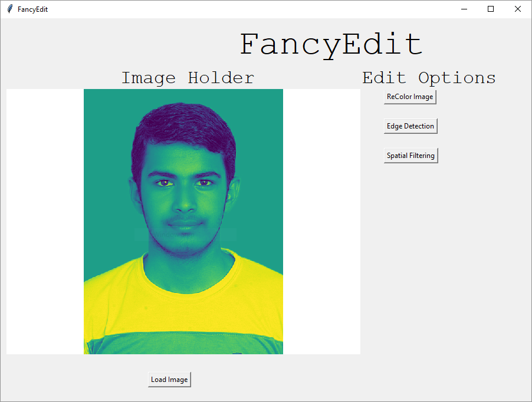
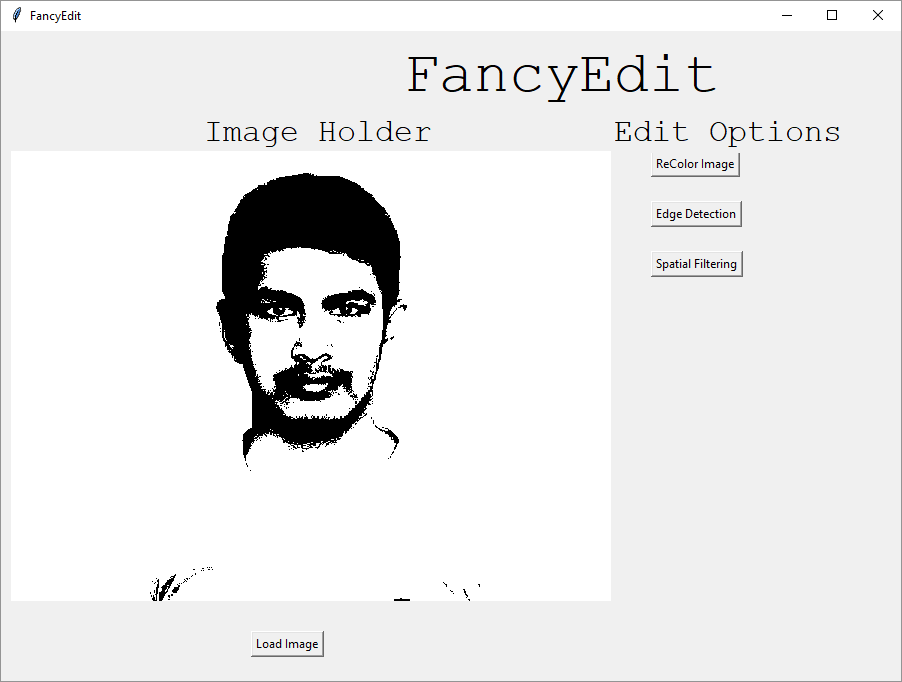

# FancyEdit
This is a software for editing photos. It incorporates basic DIP techniques at the moment. Techniques such as machine learning and deep learning for several tasks such as segmentation, image morphology will be updated sequentially. 

## Software GUI 
### Unedited Image

### Edited Image

## Edit by bella
